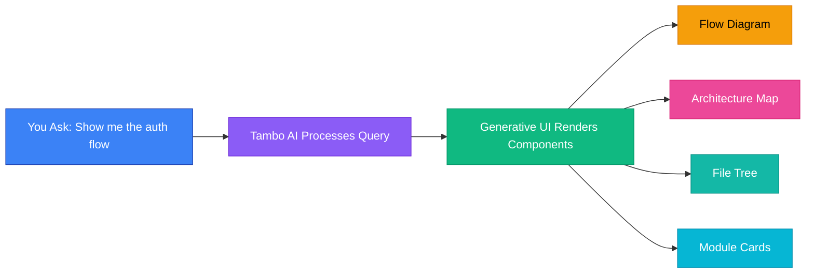
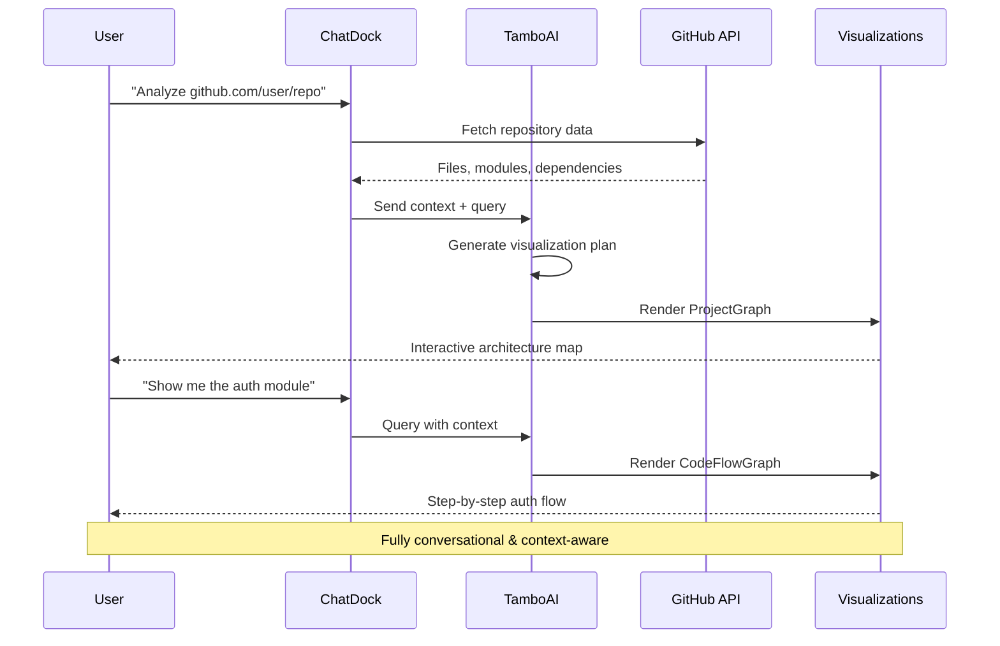
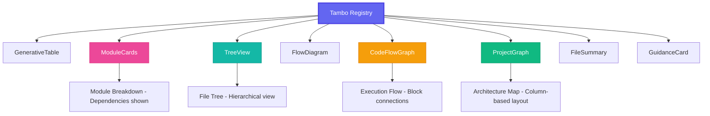
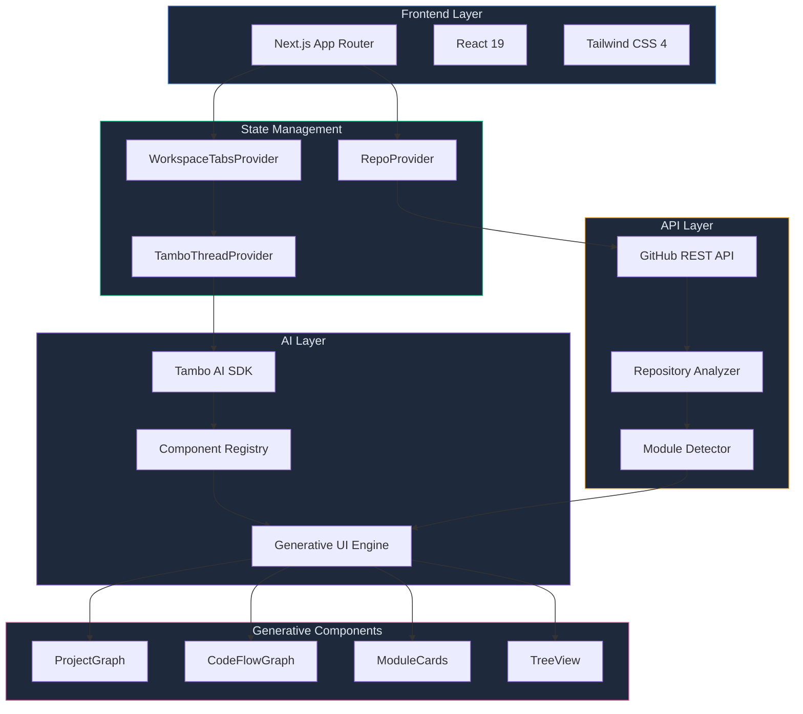
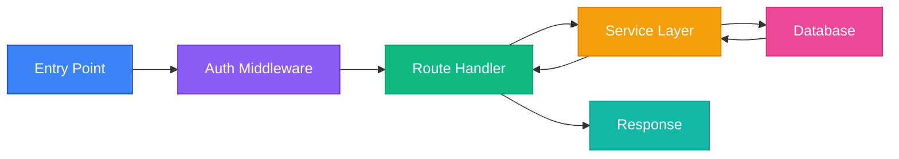
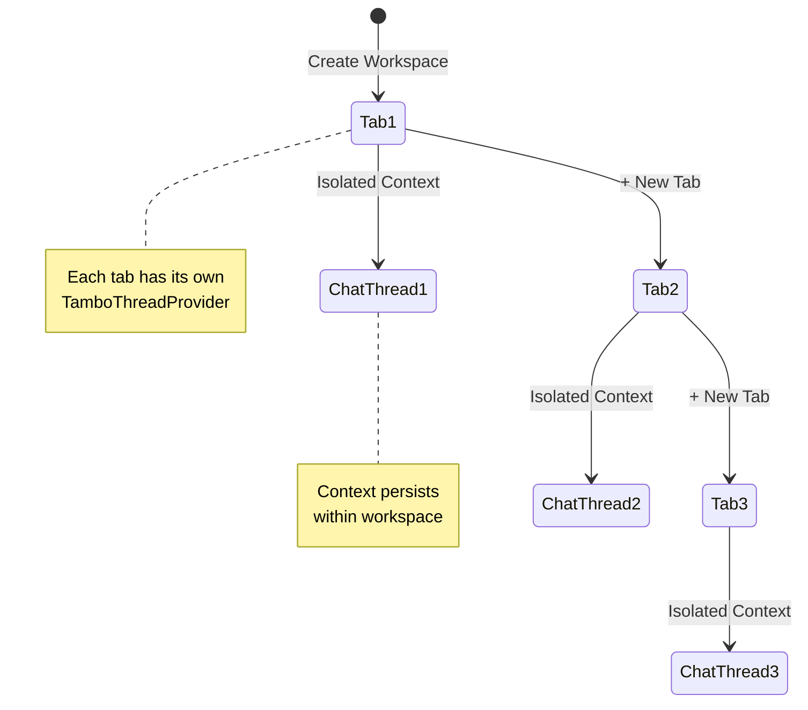
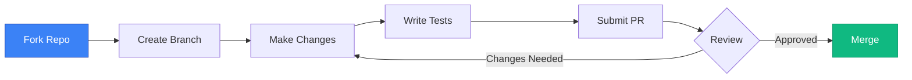

<div align="center">

# Codelore

**AI-Powered Codebase Navigator with Generative UI**

[](https://nextjs.org/)
[](https://react.dev/)
[](https://tambo.ai/)
[](https://www.typescriptlang.org/)
[](https://tailwindcss.com/)

*Talk to your codebase. Watch it visualize itself.*

[Features](#features) • [Demo](#demo) • [Quick Start](#quick-start) • [Architecture](#architecture) • [Tech Stack](#tech-stack)

</div>

---

## What is Codelore?

Codelore is a **conversational developer tool** where AI dynamically reshapes the UI to help you understand large codebases faster. Instead of reading static documentation, you **talk to your codebase** and it shows you relevant visualizations in real-time.



## Features

<table>
<tr>
<td width="50%">

### AI-Powered Analysis
- Real-time GitHub repository parsing
- Automatic module & dependency detection
- Language/framework identification
- Smart code flow analysis

</td>
<td width="50%">

### Dynamic Visualizations
- **Project Graph** - Interactive architecture map
- **Code Flow** - Step-by-step execution paths
- **Module Cards** - Component breakdowns
- **Tree View** - File system explorer

</td>
</tr>
<tr>
<td width="50%">

### Conversational Interface
- Natural language queries
- Context-aware responses
- Multi-workspace tabs
- Per-workspace chat threads

</td>
<td width="50%">

### Developer Experience
- Comic-style brutal UI
- Dark theme optimized for coding
- Zoom & pan on graphs
- Instant GitHub integration

</td>
</tr>
</table>

## Demo

### System Architecture Flow



### Component Registry



## Quick Start

### Prerequisites

- Node.js 18+ 
- GitHub Personal Access Token ([create one here](https://github.com/settings/tokens))
- Tambo AI API Key ([sign up at tambo.ai](https://tambo.ai))

### Installation

```bash
# Clone the repository
git clone https://github.com/yourusername/codelore.git
cd codelore

# Install dependencies
npm install

# Set up environment variables
cp .env.example .env
# Add your API keys to .env:
# NEXT_PUBLIC_TAMBO_API_KEY=tambo_xxx
# GITHUB_TOKEN=ghp_xxx

# Run development server
npm run dev
```

Open [http://localhost:3000](http://localhost:3000) and start exploring!

### Using Codelore

1. **Connect a Repository**
   ```
   Enter any GitHub URL: https://github.com/facebook/react
   ```

2. **Ask Questions**
   - "Show me the project architecture"
   - "What are the main modules?"
   - "Explain the authentication flow"
   - "Generate a dependency graph"

3. **Interact with Visualizations**
   - Zoom & pan on graphs
   - Click nodes for details
   - Open multiple workspace tabs
   - Export diagrams

## Architecture



### Project Structure

```
codelore/
├── app/
│   ├── api/
│   │   └── github/           # GitHub API integration
│   │       ├── route.ts      # Repository fetching
│   │       └── analyze/      # Code analysis endpoint
│   ├── interface/            # Main workspace UI
│   └── layout.tsx            # Root layout with providers
├── components/
│   ├── generative/           # AI-rendered components
│   │   ├── ProjectGraph.tsx  # Architecture visualizer
│   │   ├── CodeFlowGraph.tsx # Execution flow
│   │   ├── ModuleCards.tsx   # Module breakdown
│   │   └── TreeView.tsx      # File explorer
│   ├── workspace/            # Workspace interface
│   │   ├── ChatDock.tsx      # Chat sidebar
│   │   ├── InfiniteCanvas.tsx# Visual canvas
│   │   └── TopNavbar.tsx     # Multi-tab navigation
│   ├── providers/            # Context providers
│   │   ├── RepoProvider.tsx
│   │   └── WorkspaceTabsProvider.tsx
│   └── ui/                   # Base UI components
│       └── ComicPanel.tsx
└── lib/
    ├── tambo-registry.ts     # Component registration
    └── utils.ts              # Utilities
```

## Tech Stack

<table>
<tr>
<td width="33%" align="center">

### Frontend


</td>
<td width="33%" align="center">

### AI & State


</td>
<td width="33%" align="center">

### Integrations


</td>
</tr>
</table>

## Key Features Deep Dive

### 1. Dynamic Project Graph

The **ProjectGraph** component creates an interactive architecture map:

```typescript
// Auto-detects module types and arranges in columns
Frontend → Routes/API → Controllers → Services → Database
   ↓          ↓            ↓            ↓         ↓
  [Nodes grouped by type rank with smart layout]
```

**Features:**
- Auto-layout by module type
- Bezier curve connections with labels
- Dark theme with neon glow effects
- Zoom & pan controls
- Connection dots at endpoints
- Edge type legend

### 2. Code Flow Graph

Visualizes execution flow through your codebase:



### 3. Multi-Workspace Tabs

Work with multiple repositories simultaneously:



## UI Design Philosophy

Codelore uses a **comic/brutal design system** inspired by developer tools that prioritize clarity over polish:

- **Dark theme optimized for code**
- **Bold borders & chunky shadows**
- **Neon accent colors for graphs**
- **Comic Neue & Bangers fonts**
- **High-contrast readable text**

## Configuration

### Environment Variables

```bash
# Required
NEXT_PUBLIC_TAMBO_API_KEY=tambo_xxx  # Get from tambo.ai
GITHUB_TOKEN=ghp_xxx                  # Personal access token

# Optional
NEXT_PUBLIC_API_URL=http://localhost:3000  # API endpoint
```

### Tambo Registry

Register custom components in `lib/tambo-registry.ts`:

```typescript
export const registry: TamboRegistry = {
  components: [
    {
      name: "YourComponent",
      component: YourComponent,
      schema: z.object({
        title: z.string(),
        data: z.any(),
      }),
      description: "What your component does",
    },
  ],
};
```

## Deployment

### Deploy to Vercel (Recommended)

[](https://vercel.com/new/clone?repository-url=https://github.com/yourusername/codelore)

```bash
# Install Vercel CLI
npm i -g vercel

# Deploy
vercel
```

### Docker Deployment

```dockerfile
FROM node:18-alpine
WORKDIR /app
COPY package*.json ./
RUN npm install
COPY . .
RUN npm run build
EXPOSE 3000
CMD ["npm", "start"]
```

## Contributing

We welcome contributions! Here's how you can help:



### Development Workflow

1. **Fork & Clone**
   ```bash
   git clone https://github.com/yourusername/codelore.git
   ```

2. **Create Feature Branch**
   ```bash
   git checkout -b feature/amazing-feature
   ```

3. **Commit Changes**
   ```bash
   git commit -m "feat: add amazing feature"
   ```

4. **Push & PR**
   ```bash
   git push origin feature/amazing-feature
   ```

## License

MIT License - see [LICENSE](LICENSE) for details

## Acknowledgments

- [Tambo AI](https://tambo.ai) - Generative UI framework
- [Next.js](https://nextjs.org) - React framework
- [Tailwind CSS](https://tailwindcss.com) - Styling
- [Lucide Icons](https://lucide.dev) - Icon library

---

<div align="center">

**Built with AI by developers, for developers**

[Star on GitHub](https://github.com/yourusername/codelore) • [Report Bug](https://github.com/yourusername/codelore/issues) • [Request Feature](https://github.com/yourusername/codelore/issues)

</div>
